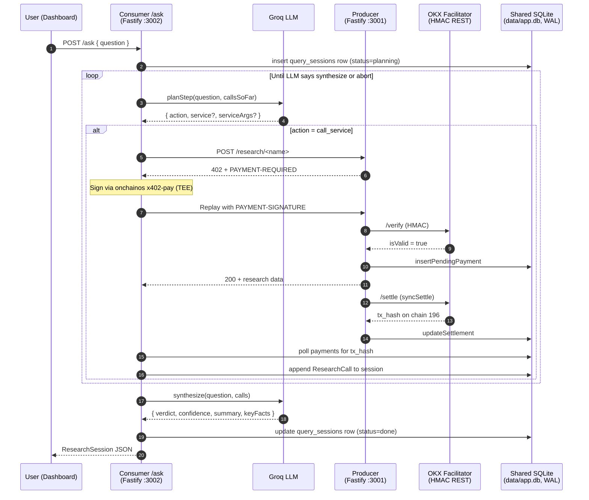

# Celina - x402 Onchain Intelligence Agent

Celina is an onchain research agent on X Layer. You ask it a question about a token, a wallet, or a market situation, and it pays for the answer. Every paid call is a real x402 HTTP micropayment settled in USDG on X Layer chain 196. Zero gas because USDG transfers on X Layer cost nothing.

Built for the OKX Build X hackathon, X Layer Arena track (I'm Human subcategory).

## What it does

Type a question like "is 0x4ae4...d2dc8 a safe token to buy?" into the dashboard. Celina parses the question, picks one of five paid research services, signs an x402 payment proof via the OKX Agentic Wallet, replays the HTTP request with the proof, reads the paywalled data, and decides whether it needs another call. When it has enough evidence it synthesizes a verdict with a confidence rating and a short list of concrete facts from the data it saw. The dashboard shows the question, each paid call (with its X Layer tx hash), and the final report card, all in one view.

The agent is goal-directed, not a random-walk loop. It plans the next step with a Groq LLM, treats each service as a priced tool, and stops as soon as it can answer. A single question typically costs 0.01 to 0.05 USDG and runs 1 to 3 paid service calls.

## Agents and Onchain Identity

Celina's onchain identity is an **OKX Agentic Wallet** created through the `onchainos wallet` CLI under a single AK (API key) login. One wallet login owns two X Layer accounts, and each account has a distinct role.

| Agent | Account ID (Agentic Wallet) | X Layer address | Role |
|---|---|---|---|
| Consumer | `c90a20ab-d544-47e6-b227-0c259e0db291` | `0x5fa0f8f77b47ea1ca48d8c9ed8560a130ad64e25` | The intelligence agent. Holds USDG, plans research steps with Groq, signs x402 proofs, replays paid HTTP requests, synthesizes verdicts. |
| Producer | `a782c10a-0678-4164-8419-2085797410d6` | `0xdfe57c7775f09599d12d11370a0afcb27f6aadbc` | The research service host. Exposes 5 paid routes behind x402 paywalls, queries OnchainOS modules, collects USDG. |

Both roles live inside one Agentic Wallet login so the credentials set in `.env` stays small and the Producer and Consumer can be audited as one economic unit on OKLink. Neither side ever holds a private key in application memory; every signature goes through the `onchainos` CLI, which keeps keys inside the wallet's TEE.

## Architecture Overview

A research session starts with one POST from the dashboard and drives a loop inside the Consumer that keeps calling paid services until the LLM decides it has enough:



All three processes (Producer, Consumer, Dashboard) resolve `data/app.db` to the same absolute path, so the Producer's settlement write is visible to the Consumer's payment poll and to the Dashboard's session list without any IPC layer. SQLite runs in WAL mode for concurrent reads.

The Consumer session runner lives in [`apps/consumer/src/agent/session-runner.ts`](apps/consumer/src/agent/session-runner.ts). It hard-caps the number of calls per session (default 4) so a broken LLM can never burn the whole USDG balance, and it writes every state transition back to the `query_sessions` table so the dashboard can show mid-flight state while the research runs.

### Monorepo layout

```
x402-earn-pay-earn/
  apps/
    producer/         Fastify service, x402-gate plugin, 5 paid research routes
    consumer/         Fastify /ask server, session runner, goal-directed Groq reasoner
    dashboard/        Next.js 14 App Router: AskBox, ReportCard, session history, live balance
  packages/
    shared/           TypeScript types, constants, Zod schemas for MCP + x402 + research
    okx-auth/         HMAC-SHA256 signer for Facilitator REST auth
    orchestrator/     SQLite store (cycles, payments, query_sessions), event bus, state machine
    mcp-client/       OKX MCP JSON-RPC client with envelope unwrapping
    onchain-clients/  Typed wrappers for onchainos CLI (wallet, x402-payment, trenches, security)
  scripts/
    src/health-check.ts    Pre-flight validation
    src/spikes/            Day-1 and pivot verification spikes (kept as evidence)
  data/                    SQLite database (gitignored)
  .env                     All env vars (gitignored)
```

## Deployment Addresses

Celina does not deploy a custom smart contract. The app pays in USDG (Global Dollar), a stablecoin issued by Paxos Digital Singapore under the Global Dollar Network and brought to X Layer via OKX's GDN membership. OKX is a GDN member, not the issuer.

| Role | X Layer address |
|---|---|
| Consumer (buyer) | `0x5fa0f8f77b47ea1ca48d8c9ed8560a130ad64e25` |
| Producer (seller) | `0xdfe57c7775f09599d12d11370a0afcb27f6aadbc` |
| USDG token contract | `0x4ae46a509f6b1d9056937ba4500cb143933d2dc8` |
| USDT token contract | `0x779ded0c9e1022225f8e0630b35a9b54be713736` |

- Chain ID: `196`
- CAIP-2 identifier: `eip155:196`
- RPC URL: `https://rpc.xlayer.tech`
- Explorer: `https://www.oklink.com/xlayer`

To verify Celina is alive on-chain, look up either address on OKLink X Layer and filter for USDG token transfers. Each paid research call produces exactly one `transferWithAuthorization` signed by the Consumer and settled by the OKX Facilitator.

## OnchainOS and Uniswap Skill Usage

Celina's external surface is entirely OnchainOS. Wallet identity and TEE signing come from Agentic Wallet, x402 payment proofs are signed by the x402-payment CLI, verification and settlement run through the OKX Facilitator REST API, four of the five paid research services source their data from the OKX MCP Server, and two of them also pull from the Security module and DEX Trenches module to cover risk flags and dev history. Every module below is exercised live inside a research session.

| OnchainOS module | How Celina uses it | Code location |
|---|---|---|
| `okx-agentic-wallet` | Single AK login creates two X Layer accounts. The Consumer switches to its own account before each research session and reads its USDG balance for the dashboard card. | [`packages/onchain-clients/src/wallet.ts`](packages/onchain-clients/src/wallet.ts) |
| `okx-x402-payment` | Non-interactive CLI signs the `transferWithAuthorization` payload for each paid service call. | [`packages/onchain-clients/src/x402-payment.ts`](packages/onchain-clients/src/x402-payment.ts) |
| OKX Facilitator API | Producer calls `/api/v6/pay/x402/verify` before returning research data and `/api/v6/pay/x402/settle` after, authenticated via HMAC-SHA256 with `OK-ACCESS-*` headers. | [`packages/okx-auth/src/sign.ts`](packages/okx-auth/src/sign.ts), [`apps/producer/src/facilitator/client.ts`](apps/producer/src/facilitator/client.ts) |
| OKX MCP Server | JSON-RPC over HTTP with 9 tools wired up: `dex-okx-market-token-price-info`, `dex-okx-market-token-holder`, `dex-okx-market-candlesticks`, `dex-okx-market-trades`, `dex-okx-dex-quote`, `dex-okx-balance-total-token-balances`, `dex-okx-balance-total-value`. Every call is logged to the `mcp_calls` table and surfaced on the `/mcp` dashboard page. | [`packages/mcp-client/src/client.ts`](packages/mcp-client/src/client.ts), [`apps/producer/src/routes/`](apps/producer/src/routes/) |
| OKX Security module | Powers honeypot flag detection, approval risk scanning, and the full 23-flag token risk report used by `research-token-report`, `research-wallet-risk`, and `signal-new-token-scout`. | [`packages/onchain-clients/src/security.ts`](packages/onchain-clients/src/security.ts) |
| `okx-dex-trenches` | `memepump token-dev-info` + `memepump token-bundle-info` provide dev rug-pull history, sniper counts, and bundle-launch detection. Used by the token report and the new-token scout. | [`packages/onchain-clients/src/trenches.ts`](packages/onchain-clients/src/trenches.ts) |

Uniswap AI is not used: X Layer does not host a canonical Uniswap deployment, so any quote-related research sources its data from the OKX DEX aggregator via the MCP `dex-okx-dex-quote` tool.

## The paid research services

Every route lives on the Producer (`:3001`) behind the x402 gate. Prices are in USDG minimal units (6 decimals). All five routes are registered in [`apps/producer/src/server.ts`](apps/producer/src/server.ts).

| Service | Route | Price | What it returns |
|---|---|---|---|
| `research-token-report` | `POST /research/token-report` | 0.015 USDG | Full risk report for a token: 17 red-flag booleans from Security, dev rug-pull history from Trenches, bundle-launch detection, top-10 holder concentration, current price, overall risk score and verdict (`safe` / `caution` / `avoid`). |
| `research-wallet-risk` | `POST /research/wallet-risk` | 0.010 USDG | Wallet health check: total USD value, number of risk-flagged tokens held, active approval count from the Security module, verdict (`healthy` / `caution` / `dangerous`). |
| `research-liquidity-health` | `POST /research/liquidity-health` | 0.008 USDG | Liquidity depth by probing the OKX DEX aggregator with 10 / 100 / 1000 USDG swap sizes, plus a 24-hour candlestick volatility range. Verdict `deep` / `thin` / `fragile`. |
| `signal-whale-watch` | `POST /signal/whale-watch` | 0.005 USDG | Recent whale activity: filters the last 100 market trades for any ≥ $1000 entry, computes buy vs sell pressure, cross-references the top-holder list. Sentiment `accumulating` / `distributing` / `neutral`. |
| `signal-new-token-scout` | `POST /signal/new-token-scout` | 0.003 USDG | Momentum score for a new launch: 60 minutes of 1m candles, 24h / 1h price changes, transaction count, offset by dev rug-pull count and bundle flags. Verdict `promising` / `mixed` / `skip`. |

The Consumer does not pick services by hand. For each session the Groq reasoner reads the question plus the list of calls made so far, and returns one of: `call_service` (with service + args), `synthesize` (the data is enough), or `abort` (the question can't be answered from this menu). The full prompt that teaches the model what each service does is in [`apps/consumer/src/reasoner/prompts.ts`](apps/consumer/src/reasoner/prompts.ts).

## Running It Locally

### Prerequisites

- Node 20 (pinned in `.nvmrc`; Node 24 breaks `better-sqlite3`)
- pnpm 9
- `onchainos` CLI v2.2.8 or newer
- OKX Developer Portal API key + secret + passphrase (https://web3.okx.com/onchain-os/dev-portal)
- Groq API key, free tier is enough for the demo (https://console.groq.com/keys)
- A VPN such as Cloudflare WARP if your ISP TLS-intercepts `web3.okx.com` (some Indonesian ISPs do)

### Setup

```bash
pnpm install

cp .env.example .env
# Fill OKX_API_KEY, OKX_SECRET_KEY, OKX_PASSPHRASE, GROQ_API_KEY

onchainos wallet login
onchainos wallet add                  # creates Account 2 for Producer
onchainos wallet status               # copy Account 1 id
onchainos wallet switch <producer-id> # copy address
# Fill CONSUMER_ACCOUNT_ID, PRODUCER_ACCOUNT_ID, PRODUCER_ADDRESS in .env

# Send 5 to 10 USDG to the Consumer X Layer address
pnpm health-check
```

### Run the agent

Three terminals:

```bash
# Terminal 1
pnpm dev:producer      # Fastify :3001 with the 5 paid routes

# Terminal 2
pnpm dev:consumer      # Fastify :3002 with POST /ask

# Terminal 3
pnpm dev:dashboard     # Next.js :3000
```

Open http://localhost:3000, type a question into the AskBox, and watch Celina plan, pay, and synthesize. Every call on the report card has a clickable X Layer explorer link to the settlement tx.

### Tests

```bash
pnpm -r typecheck      # 9 workspaces
pnpm -r test           # unit tests across all workspaces
```

## Team

Celina is a solo build.

- **Jordi** - Creator and sole developer
  - GitHub: [@jordi-stack](https://github.com/jordi-stack)
  - X: [@jordialter](https://x.com/jordialter)

## Project Positioning in the X Layer Ecosystem

X Layer is OKX's L2. The ecosystem needs real agents that move money on their own, visible on-chain activity, and apps that actually use the OnchainOS + USDG rail OKX built this year. Celina is shaped to score on all three.

- **A goal the user can express in plain English.** Most x402 demos pick a fixed request pattern and run it on a timer. Celina takes natural-language questions from the judge, lets a Groq LLM plan which paid services to call, and surfaces the full trace in the dashboard. You can feel the LLM spending money to answer you.
- **Deep OnchainOS integration.** Every external call goes through an OnchainOS module: Agentic Wallet for identity and signing, x402-payment for proofs, Facilitator for verify/settle, MCP Server for market data, Security for risk flags, Trenches for dev history. There is no direct RPC call, no manual transaction construction, no custom signer.
- **Paxos USDG on X Layer, zero-gas settlements.** USDG is the Global Dollar stablecoin from Paxos Digital Singapore, regulated under the MAS single-currency framework. OKX brought it live on X Layer through the Global Dollar Network. X Layer's gas abstraction makes USDG transfers fee-free, so Celina can run hundreds of paid research calls on a few USDG without ever touching OKB.
- **Visible traffic.** Each research session writes one to four `transferWithAuthorization` txs into OKLink, all attributable to the same agent address. A 30-minute demo produces a sessions list the judge can click through and a transactions page they can filter by wallet.
- **Boring where it matters.** State is SQLite in WAL mode. The dashboard is server-rendered Next.js. The LLM is Groq. The retry logic is a state machine with counted transitions. Every choice trades ambition for demo-day reliability.

## License

MIT
