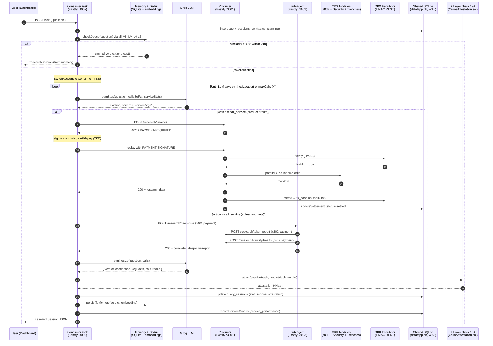

# Celina - x402 Onchain Intelligence Agent

Celina is an onchain research agent on X Layer. You ask it a question about a token, a wallet, or a market situation, and it pays for the answer. Every paid call is a real x402 HTTP micropayment settled in USDG on X Layer chain 196. Zero gas because USDG transfers on X Layer cost nothing.

## What it does

Type a question like "is 0x4ae4...d2dc8 a safe token to buy?" into the dashboard. Celina parses the question, picks one of seven paid research services, signs an x402 payment proof via the OKX Agentic Wallet, replays the HTTP request with the proof, reads the paywalled data, and decides whether it needs another call. When it has enough evidence it synthesizes a verdict with a confidence score, a short list of key facts, and an on-chain attestation anchored to `CelinaAttestation.sol`.

The agent is goal-directed. It plans the next step with a Groq LLM, treats each service as a priced tool, and stops as soon as it can answer. A single question typically costs 0.01 to 0.05 USDG and runs 1 to 3 paid service calls. Similar questions answered in the last 24 hours return from memory at zero cost.

## Agents and Onchain Identity

Celina's onchain identity is an **OKX Agentic Wallet** created through the `onchainos wallet` CLI under a single AK (API key) login. One wallet login owns three X Layer accounts, each with a distinct role.

| Agent | Account ID (Agentic Wallet) | X Layer address | Role |
|---|---|---|---|
| Consumer | `c90a20ab-d544-47e6-b227-0c259e0db291` | `0x5fa0f8f77b47ea1ca48d8c9ed8560a130ad64e25` | The intelligence agent. Holds USDG, plans research steps with Groq, signs x402 proofs, replays paid HTTP requests, synthesizes verdicts, and anchors each verdict to `CelinaAttestation.sol`. |
| Producer | `a782c10a-0678-4164-8419-2085797410d6` | `0xdfe57c7775f09599d12d11370a0afcb27f6aadbc` | The research service host. Exposes 7 paid routes behind x402 paywalls, queries OnchainOS modules, collects USDG. |
| Sub-agent | `SUBAGENT_ACCOUNT_ID` in `.env` | `SUBAGENT_ADDRESS` in `.env` | A third account that hosts the `research-deep-dive` composed service on `:3003`. Consumer pays the Sub-agent via x402; the Sub-agent then pays the Producer via x402 for `research-token-report` + `research-liquidity-health` and correlates the two reports into one verdict. This is the agent-to-agent x402 chain: Consumer → Sub-agent → Producer, two independent wallet-to-wallet settlements inside one user request. |

All three roles live under one AK login so credentials stay minimal and all three agent addresses can be audited as one economic unit on OKLink. No private key ever enters application memory; every signature goes through the `onchainos` CLI, which keeps keys inside the wallet's TEE.

## Architecture Overview

A research session starts with one POST from the dashboard and drives a loop inside the Consumer that keeps calling paid services until the LLM decides it has enough:



All three processes (Producer, Consumer, Dashboard) resolve `data/app.db` to the same absolute path, so the Producer's settlement write is visible to the Consumer's payment poll and to the Dashboard's session list without any IPC layer. SQLite runs in WAL mode for concurrent reads.

The Consumer session runner lives in [`apps/consumer/src/agent/session-runner.ts`](apps/consumer/src/agent/session-runner.ts). It hard-caps calls per session (default 4), writes every state transition to `query_sessions` so the dashboard can show live progress, and gracefully synthesizes from partial data if the Groq planner errors mid-session after at least one paid call has settled. A flaky LLM never wastes a paid call.

After each completed session the runner does three additional things: anchors the verdict hash to `CelinaAttestation.sol` on chain 196, persists the verdict to session memory (24h TTL, embedded via `all-MiniLM-L6-v2`), and records each call's LLM-assigned usefulness score to `service_performance` so the planner can bias toward high-performing services in future sessions.

### Monorepo layout

```
x402-earn-pay-earn/
  apps/
    producer/         Fastify :3001, x402-gate plugin, 7 paid research routes
    consumer/         Fastify :3002, /ask server, session runner, Groq reasoner, memory/dedup
    subagent/         Fastify :3003, composed deep-dive service that pays Producer via x402
    dashboard/        Next.js 14 App Router: AskBox, ReportCard, /tx, /mcp, /learning, /compare, /memory
  packages/
    shared/           TypeScript types, constants, Zod schemas for MCP + x402 + research
    okx-auth/         HMAC-SHA256 signer for Facilitator REST auth
    orchestrator/     SQLite store (query_sessions, payments, mcp_calls, session_memory, service_performance), event bus
    mcp-client/       OKX MCP JSON-RPC client with envelope unwrapping
    onchain-clients/  Typed wrappers for onchainos CLI (wallet, x402-payment, trenches, security, attestation)
    x402-server/      Reusable Fastify x402-gate plugin (shared by Producer and Sub-agent)
    contracts/        CelinaAttestation.sol + ABI + deploy script
  scripts/
    src/health-check.ts    Pre-flight validation
    src/spikes/            Day-1 and pivot verification spikes (kept as evidence)
  data/                    SQLite database (gitignored)
  .env                     All env vars (gitignored)
  SKILL.md                 Machine-readable agent capability manifest
  docker-compose.yml       One-command local bring-up for all four services
```

## Deployment Addresses

Celina pays in USDG (Global Dollar), a stablecoin issued by Paxos Digital Singapore under the Global Dollar Network. OKX is a GDN member that brought USDG live on X Layer; it is not the issuer.

Celina also deploys `CelinaAttestation.sol` — a minimal on-chain registry where every synthesized verdict is anchored by its hash. The contract was deployed via the Arachnid CREATE2 factory with `salt = keccak256('celina-attestation-v1')`.

| Role | X Layer address |
|---|---|
| Consumer (buyer) | `0x5fa0f8f77b47ea1ca48d8c9ed8560a130ad64e25` |
| Producer (seller) | `0xdfe57c7775f09599d12d11370a0afcb27f6aadbc` |
| CelinaAttestation.sol | [`0x3d3AA2fad1a36fCe912f1c17F588270C5bEb810B`](https://www.oklink.com/xlayer/address/0x3d3AA2fad1a36fCe912f1c17F588270C5bEb810B) |
| USDG token contract | `0x4ae46a509f6b1d9056937ba4500cb143933d2dc8` |
| USDT token contract | `0x779ded0c9e1022225f8e0630b35a9b54be713736` |

- Chain ID: `196`
- CAIP-2 identifier: `eip155:196`
- RPC URL: `https://rpc.xlayer.tech`
- Explorer: `https://www.oklink.com/xlayer`

To verify Celina is alive on-chain, look up either address on OKLink X Layer and filter for USDG token transfers. Each paid research call produces exactly one `transferWithAuthorization` signed by the Consumer and settled by the OKX Facilitator. Full Consumer wallet history is at [oklink.com/xlayer/address/0x5fa0f8f7...0ad64e25](https://www.oklink.com/xlayer/address/0x5fa0f8f77b47ea1ca48d8c9ed8560a130ad64e25).

### Verified end-to-end on chain 196

A deterministic coverage sweep on 2026-04-15 hit all five core research and signal services back-to-back, plus two follow-up calls on the alternate stablecoin so the on-chain footprint spans seven independent settlements. The two v2 additions (`research-deep-dive` via the Sub-agent and `action-swap-exec`) were added after the sweep and exercise the same x402 payment flow. Each call:

1. fetched the route and got `402 + PAYMENT-REQUIRED`
2. signed via the OKX Agentic Wallet's TEE (`onchainos payment x402-pay`)
3. replayed the request with `PAYMENT-SIGNATURE`
4. waited for the OKX Facilitator to verify and settle
5. wrote the on-chain `tx_hash` into the shared SQLite payments table

| # | Service | Input | Price | OnchainOS modules touched | Settlement tx |
|---|---|---|---|---|---|
| 1 | `research-token-report` | USDG | 0.015 USDG | MCP price + holders, Security `tokenScan`, Trenches dev + bundle | [`0xc06e412d...754daa`](https://www.oklink.com/xlayer/tx/0xc06e412dfdc288368002ee21287c8ef792982fd43a09832f5c5f043a5d754daa) |
| 2 | `research-wallet-risk` | Consumer wallet | 0.010 USDG | MCP `balance-total-value` + `total-token-balances`, Security `approvals` | [`0x32c0cd2a...1cf15a`](https://www.oklink.com/xlayer/tx/0x32c0cd2a51d17b2d0fda48daf0cb0f09d8985d81b45ab61d6cf5b574491cf15a) |
| 3 | `research-liquidity-health` | USDT | 0.008 USDG | MCP `dex-quote` (3 probes) + `candlesticks` | [`0x13b284a5...45ea33`](https://www.oklink.com/xlayer/tx/0x13b284a57827d6c9d82c822c947b2f2ec8e01094908549f441cc09b8f045ea33) |
| 4 | `signal-whale-watch` | USDG | 0.005 USDG | MCP `market-trades` + `token-holder` | [`0x16163160...21c0de`](https://www.oklink.com/xlayer/tx/0x161631605080c063d0f14c04945b37afde0fcdc83ce18fdb7aad46a08721c0de) |
| 5 | `signal-new-token-scout` | USDT | 0.003 USDG | MCP price + `candlesticks`, Security `tokenScan`, Trenches dev + bundle | [`0x3d423fa0...e2fc03`](https://www.oklink.com/xlayer/tx/0x3d423fa0085e67507f62f4a19374b7ecd06e26c3a332c0bc1c4943ce31e2fc03) |
| 6 | `research-token-report` | USDT | 0.015 USDG | MCP price + holders, Security `tokenScan`, Trenches dev + bundle | [`0xc496d74c...e7bf59`](https://www.oklink.com/xlayer/tx/0xc496d74c6806a1234be12ccba1fef64a64af4c1c62aabcd0f6e286bd05e7bf59) |
| 7 | `signal-new-token-scout` | USDG | 0.003 USDG | MCP price + `candlesticks`, Security `tokenScan`, Trenches dev + bundle | [`0x613ef799...31f231c`](https://www.oklink.com/xlayer/tx/0x613ef799cc53f81ea376fc283f0550816261a6857d54f661c11c5f27631f231c) |

Total spent: 0.059 USDG across seven `transferWithAuthorization` settlements in about 13 seconds. The seven calls collectively fire all 7 unique MCP tools wired in `OKXMCPClient`, both Security endpoints (`tokenScan` and `approvals`), and both Trenches memepump commands (`token-dev-info` and `token-bundle-info`). Rows 6 and 7 reuse two services from rows 1 and 5 with the alternate stablecoin to prove the routes are general-purpose, not hardcoded to USDG.

## OnchainOS and Uniswap Skill Usage

Celina's external surface is entirely OnchainOS. Wallet identity and TEE signing come from Agentic Wallet, x402 payment proofs are signed by the x402-payment CLI, verification and settlement run through the OKX Facilitator REST API, and every paid research service calls the OKX MCP Server. Two of them also query the Security module via `tokenScan`, one more reads Security's `approvals` endpoint, and two pull from the DEX Trenches module for dev and launch history. Every module below is exercised live inside a research session.

| OnchainOS module | How Celina uses it | Code location |
|---|---|---|
| `okx-agentic-wallet` | Single AK login owns three X Layer accounts (Consumer, Producer, Sub-agent). Each process calls `switchAccount` to its own id before signing, and the Consumer also reads its USDG balance through this module for the dashboard balance card. | [`packages/onchain-clients/src/wallet.ts`](packages/onchain-clients/src/wallet.ts) |
| `okx-x402-payment` | Non-interactive CLI signs the `transferWithAuthorization` payload for each paid service call. The Sub-agent reuses the same client to pay the Producer under Account 3. | [`packages/onchain-clients/src/x402-payment.ts`](packages/onchain-clients/src/x402-payment.ts) |
| OKX Facilitator API | Producer and Sub-agent both call `/api/v6/pay/x402/verify` before returning research data and `/api/v6/pay/x402/settle` after, authenticated via HMAC-SHA256 with `OK-ACCESS-*` headers. The shared gate and facilitator client live in `@x402/x402-server`. | [`packages/okx-auth/src/sign.ts`](packages/okx-auth/src/sign.ts), [`packages/x402-server/src/facilitator-client.ts`](packages/x402-server/src/facilitator-client.ts) |
| OKX MCP Server | JSON-RPC over HTTP with 7 tools wired up: `dex-okx-market-token-price-info`, `dex-okx-market-token-holder`, `dex-okx-market-candlesticks`, `dex-okx-market-trades`, `dex-okx-dex-quote`, `dex-okx-balance-total-token-balances`, `dex-okx-balance-total-value`. Every call is logged to the `mcp_calls` table and surfaced on the `/mcp` dashboard page. | [`packages/mcp-client/src/client.ts`](packages/mcp-client/src/client.ts), [`apps/producer/src/routes/`](apps/producer/src/routes/) |
| OKX Security module | Two separate endpoints. `tokenScan` returns the 23-field risk report that `research-token-report` filters down to 17 actionable flags and that `signal-new-token-scout` checks for 6 blocking flags. `approvals` returns outstanding token approvals for a wallet and is used by `research-wallet-risk` to estimate attack surface. | [`packages/onchain-clients/src/security.ts`](packages/onchain-clients/src/security.ts) |
| `okx-dex-trenches` | `memepump token-dev-info` + `memepump token-bundle-info` provide dev rug-pull history, sniper counts, and bundle-launch detection. Used by the token report and the new-token scout. | [`packages/onchain-clients/src/trenches.ts`](packages/onchain-clients/src/trenches.ts) |
| `okx-x402-payment` (attestation) | The Consumer signs the canonical verdict JSON and calls `attest(sessionHash, verdictHash, verdict)` on `CelinaAttestation.sol` after every synthesis. Any verifier can read the contract directly or call `GET /verify/:sessionHash` on the Consumer API. | [`packages/onchain-clients/src/attestation.ts`](packages/onchain-clients/src/attestation.ts), [`packages/contracts/`](packages/contracts/) |

Uniswap AI is not used: X Layer does not host a canonical Uniswap deployment, so any quote-related research sources its data from the OKX DEX aggregator via the MCP `dex-okx-dex-quote` tool.

## The paid research services

Seven paid services are available. Six live on the Producer (`:3001`): the five core research and signal routes plus the real DEX swap (`action-swap-exec`). The seventh lives on the Sub-agent (`:3003`) as an agent-to-agent composed call. Prices are USDG minimal units (6 decimals).

### Service catalog

| Service | Route | Price | Input | What it returns |
|---|---|---|---|---|
| [`research-token-report`](apps/producer/src/routes/research-token-report.ts) | `POST /research/token-report` | 0.015 USDG | `{ "tokenAddress": "0x..." }` | Risk + fundamentals report. 17 actionable Security flags filtered out of the 23-field token scan, dev rug-pull history and bundle-launch detection from Trenches, top-1 + top-10 holder concentration, current price + market cap, scored risk verdict (`safe` / `caution` / `avoid`). |
| [`research-wallet-risk`](apps/producer/src/routes/research-wallet-risk.ts) | `POST /research/wallet-risk` | 0.010 USDG | `{ "address": "0x..." }` | Wallet health snapshot. Total USD portfolio value, asset count, list of risk-flagged tokens held, outstanding token approvals from the Security `approvals` endpoint, scored verdict (`healthy` / `caution` / `dangerous`). |
| [`research-liquidity-health`](apps/producer/src/routes/research-liquidity-health.ts) | `POST /research/liquidity-health` | 0.008 USDG | `{ "tokenAddress": "0x..." }` | Slippage curve from probing the OKX DEX aggregator at 10 / 100 / 1000 USDG sell sizes, plus a 24-hour 1H candlestick volatility range. Verdict `deep` / `thin` / `fragile`. |
| [`signal-whale-watch`](apps/producer/src/routes/signal-whale-watch.ts) | `POST /signal/whale-watch` | 0.005 USDG | `{ "tokenAddress": "0x..." }` | Whale activity in the last 100 trades. Filters for entries above $1,000 USD, computes whale buy vs sell volume balance, cross-references each whale wallet against the top-50 holder list. Sentiment `accumulating` / `distributing` / `neutral`. |
| [`signal-new-token-scout`](apps/producer/src/routes/signal-new-token-scout.ts) | `POST /signal/new-token-scout` | 0.003 USDG | `{ "tokenAddress": "0x..." }` | Momentum + safety score for a young launch. 60 minutes of 1m candles, 24h / 4h / 1h price changes, hourly tx count, offset by dev rug-pull count, bundle launch detection, sniper count, and 6 blocking security flags from the Security tokenScan. Verdict `promising` / `mixed` / `skip`. |
| [`research-deep-dive`](apps/subagent/src/routes/) | `POST /research/deep-dive` | 0.030 USDG | `{ "tokenAddress": "0x..." }` | **Agent-to-agent composed analysis.** The Sub-agent (Account 3) pays the Producer via x402 for `research-token-report` + `research-liquidity-health`, then correlates the two reports into a single deep-dive verdict. Consumer → Sub-agent → Producer is a three-hop x402 chain where two separate agent wallets settle on-chain. |
| [`action-swap-exec`](apps/producer/src/routes/action-swap-exec.ts) | `POST /action/swap-exec` | 0.020 USDG | `{ "fromToken": "0x...", "toToken": "0x...", "readableAmount": "0.005" }` | **Real DEX swap** on X Layer via the OKX aggregator (routes through available liquidity pools for best price). Returns the execution tx hash and route details. The planner only picks this service when the user explicitly asks to execute a trade. |

### Request and response shape

Every route is `Content-Type: application/json` and protected by the x402 gate. A naked POST returns `402` with a base64-encoded `PAYMENT-REQUIRED` header containing the x402 v2 challenge. After signing via `onchainos payment x402-pay`, the client replays the same POST with a base64-encoded `PAYMENT-SIGNATURE` header. On success the server returns `200` with this envelope:

```json
{
  "service": "research-token-report",
  "data": { /* service-specific payload, see below */ },
  "servedAt": 1776251704123
}
```

Example `data` payload from a real `research-token-report` call against USDG (truncated):

```json
{
  "tokenAddress": "0x4ae46a509f6b1d9056937ba4500cb143933d2dc8",
  "chainIndex": "196",
  "price": {
    "price": "1.000075208702731590855738638350157",
    "marketCap": "268470189.776248295565223037",
    "holders": "44746",
    "priceChange24H": "-0.01",
    "volume24H": "54758.32"
  },
  "security": {
    "isHoneypot": false,
    "isMintable": true,
    "isRiskToken": false,
    "isAirdropScam": false,
    "isCounterfeit": false,
    "buyTaxes": "0",
    "sellTaxes": "0"
  },
  "dev": {
    "rugPullCount": 0,
    "bundleDetected": false,
    "sniperCount": 0
  },
  "holders": {
    "top10Percent": 71.25,
    "top1Percent": 51.39,
    "sampleSize": 100
  },
  "signals": {
    "redFlags": ["isMintable"],
    "riskScore": 8,
    "verdict": "safe",
    "reasons": ["1 security red flags"]
  }
}
```

Each service's response shape is defined inline in its route file, and every Producer-side OnchainOS call (MCP tool, Security endpoint, Trenches command) is logged into the `mcp_calls` SQLite table for the dashboard `/mcp` page to render.

### How the Consumer picks services

The Consumer never picks a service by hand. For each session step, the Groq reasoner reads the user question plus the list of calls already made and returns one of three actions:

- `call_service` with a `service` name and `serviceArgs` body. The runner dispatches to the named route via the x402 dance described above.
- `synthesize`. The data already gathered is enough, finalize the verdict.
- `abort`. The question can't be answered from this menu.

The full prompt that teaches the model what each service does, including the price, summary, and example args, lives in [`apps/consumer/src/reasoner/prompts.ts`](apps/consumer/src/reasoner/prompts.ts) and is built from the [`RESEARCH_SERVICE_CATALOG`](packages/shared/src/constants.ts) constant in the shared package so Consumer, Producer, and Dashboard all read the same source of truth for prices and route paths.

### Calling a service from outside Celina

All seven routes are normal HTTP endpoints, so anything that can do the x402 dance can hit them. The deterministic coverage script at [`scripts/src/spikes/research-routes-smoke.ts`](scripts/src/spikes/research-routes-smoke.ts) drives every route at the OnchainOS client level (bypassing Fastify) for live-data verification, and the same wire format is exercised end-to-end via the Consumer in `session-runner.ts` and reproduced in the worked-example sweep above. The seven settled tx hashes in the [Verified end-to-end on chain 196](#verified-end-to-end-on-chain-196) section were each produced by exactly this flow. `research-deep-dive` additionally produces two nested settlements because the Sub-agent itself signs x402 payments to the Producer for the two upstream services it composes.

## Running It Locally

### Prerequisites

- Node 20 (pinned in `.nvmrc`; Node 24 breaks `better-sqlite3`)
- pnpm 9
- `onchainos` CLI v2.2.8 or newer
- OKX Developer Portal API key + secret + passphrase (https://web3.okx.com/onchain-os/dev-portal)
- Groq API key, free tier is enough for the demo (https://console.groq.com/keys)

### Setup

```bash
pnpm install

cp .env.example .env
# Fill OKX_API_KEY, OKX_SECRET_KEY, OKX_PASSPHRASE, GROQ_API_KEY

# Next.js only auto-loads .env from the app's own directory, so symlink
# the dashboard to the repo-root .env we just populated.
ln -s ../../.env apps/dashboard/.env

# Create three agent accounts under one AK login: Consumer (Account 1,
# created automatically), Producer (Account 2), and Sub-agent (Account 3).
onchainos wallet login
onchainos wallet add                   # creates Account 2 for Producer
onchainos wallet add                   # creates Account 3 for Sub-agent
onchainos wallet status                # list all three ids + addresses
# Fill CONSUMER_ACCOUNT_ID + CONSUMER_ADDRESS (Account 1),
#      PRODUCER_ACCOUNT_ID + PRODUCER_ADDRESS (Account 2),
#      SUBAGENT_ACCOUNT_ID + SUBAGENT_ADDRESS (Account 3) in .env

# Send 5 to 10 USDG to the Consumer X Layer address and ~1 USDG to the
# Sub-agent address (the Sub-agent pays the Producer on deep-dive calls).
pnpm health-check
```

### Run the agent

Four terminals (or use Docker Compose, see below):

```bash
# Terminal 1
pnpm dev:producer      # Fastify :3001 — 7 paid research routes

# Terminal 2
pnpm dev:subagent      # Fastify :3003 — agent-to-agent deep-dive

# Terminal 3
pnpm dev:consumer      # Fastify :3002 — POST /ask intelligence agent

# Terminal 4
pnpm dev:dashboard     # Next.js :3000
```

Open http://localhost:3000, type a question into the AskBox, and watch Celina plan, pay, and synthesize in real time. Every call on the report card links to its X Layer settlement tx on OKLink.

The dashboard exposes five secondary pages backed by the same shared SQLite:

- `/tx` — every settled x402 payment with its on-chain hash for click-through auditing on OKLink
- `/mcp` — live rolling log of every MCP tool call the Producer makes, with success rate and average latency
- `/learning` — per-service performance leaderboard: call count, useful/wasted split, average usefulness, trend badge. Shows how Celina's planner improves across sessions.
- `/compare` — side-by-side table: Celina vs manual research time (15–90 min manual vs 6–35 sec Celina) with a full price breakdown per service
- `/memory` — active session memory table: question, cached verdict, confidence, embedding type (384-dim vs fallback), time-to-expiry

A machine-readable capability manifest is exposed at `GET /capabilities` on the Consumer API and duplicated in [`SKILL.md`](SKILL.md) for agent-to-agent discovery. The threat model is in [`threat-model.md`](threat-model.md).

### Docker Compose

```bash
cp .env.example .env
# Fill all required vars (OKX_*, GROQ_API_KEY, CONSUMER_*, PRODUCER_*, SUBAGENT_*)
docker compose up --build
```

All four services start with health checks and a shared `db_data` volume for the SQLite file. The Consumer's `transformers_cache` volume persists the `all-MiniLM-L6-v2` model weights (~22 MB downloaded on first embed call).

### Tests

```bash
pnpm -r typecheck      # 12 packages, all green
pnpm -r test           # 87 unit tests across the 12 packages
```

## Team

Celina is a solo build.

- **Jordi** - Creator and sole developer
  - GitHub: [@jordi-stack](https://github.com/jordi-stack)
  - X: [@jordialter](https://x.com/jordialter)

## Project Positioning in the X Layer Ecosystem

X Layer is OKX's L2. The ecosystem needs real agents that move money on their own, visible on-chain activity, and apps that use the OnchainOS + USDG rail OKX built this year. Celina is shaped to score on all three.

- **A goal the user can express in plain English.** Celina takes natural-language questions, lets a Groq LLM plan which paid services to call, and surfaces the full trace. You can feel the LLM spending money to answer you.
- **Agent-to-agent x402.** The `research-deep-dive` service triggers a second agent (the Sub-agent, Account 3) that pays the Producer for two raw services and correlates them. Three agent wallets settle on-chain in one user request — a live demonstration of x402 as a machine-to-machine payment layer.
- **On-chain attestation.** Every synthesized verdict is hashed and anchored to `CelinaAttestation.sol` on X Layer. OKLink changes from "USDG transfers" to "verified research verdicts". Any verifier can confirm a verdict without trusting Celina.
- **Real DEX execution.** The `action-swap-exec` service runs an actual swap on X Layer via the OKX DEX aggregator — not a quote, a real on-chain trade.
- **Memory + self-improvement.** Completed sessions are embedded with `all-MiniLM-L6-v2` and cached for 24 hours. Similar questions hit the cache at zero cost. After each session the LLM grades each paid call 0–1 for usefulness; the planner biases toward high-scoring services in future sessions.
- **Deep OnchainOS integration.** Every external call goes through an OnchainOS module: Agentic Wallet for identity and signing, x402-payment for proofs, Facilitator for verify/settle, MCP Server for market data, Security for risk flags, Trenches for dev history. No direct RPC, no manual transaction construction.
- **Paxos USDG on X Layer, zero-gas settlements.** USDG is the Global Dollar stablecoin from Paxos Digital Singapore. OKX brought it live on X Layer through the Global Dollar Network. X Layer's gas abstraction makes USDG transfers fee-free.
- **Visible traffic.** Each research session writes one to four `transferWithAuthorization` txs into OKLink. A 30-minute demo produces a sessions list the judge can click through and a transactions page they can filter by wallet.
- **Boring where it matters.** State is SQLite in WAL mode. The dashboard is server-rendered Next.js. The LLM is Groq. The retry logic is a state machine with counted transitions.

## License

MIT
